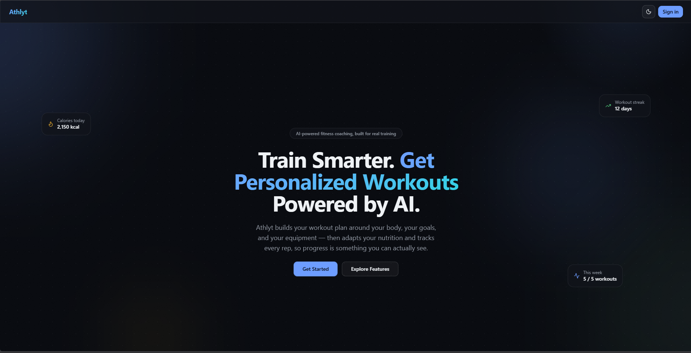
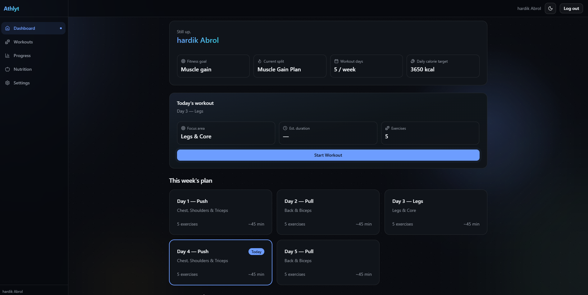
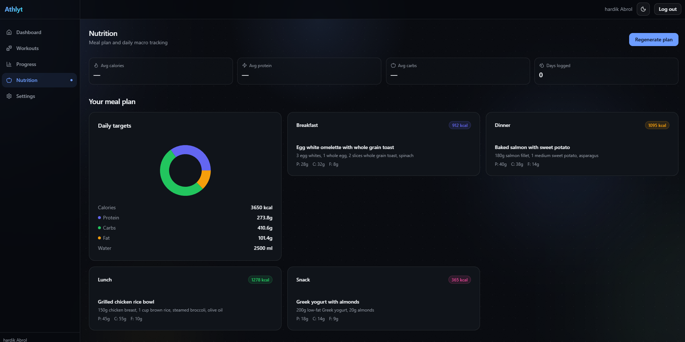
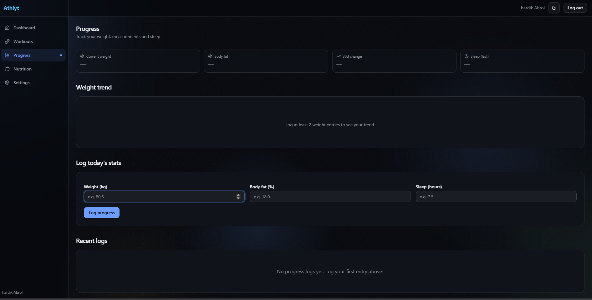

<div align="center">

# Athlyt

**Train smarter. Progress faster.**

An AI-powered fitness coaching platform — personalised workout plans, nutrition tracking, progress analytics, and workout session management. Built as a production-quality portfolio project demonstrating full-stack + ML engineering.

**🔴 [Live Demo](https://athlyt-taupe.vercel.app)** · **[API Docs](https://athlyt-backend.onrender.com/docs)**

[](https://github.com/Hardikabrol8/Athlyt/actions/workflows/backend-ci.yml)
[](https://github.com/Hardikabrol8/Athlyt/actions/workflows/frontend-ci.yml)
[](backend/tests)
[](backend/pyproject.toml)
[](frontend/package.json)
[](LICENSE)

</div>

> **Note:** the live demo runs on Render's free tier, which sleeps after ~15 minutes of inactivity. The first request after a period of inactivity may take 30–60 seconds to respond while the backend wakes up — this is expected free-tier behavior, not a bug.

---

## Screenshots

<table>
  <tr>
    <td width="50%">
      
      <p align="center"><em>Landing page</em></p>
    </td>
    <td width="50%">
      
      <p align="center"><em>Dashboard</em></p>
    </td>
  </tr>
  <tr>
    <td width="50%">
      
      <p align="center"><em>Nutrition & meal planning</em></p>
    </td>
    <td width="50%">
      
      <p align="center"><em>Progress tracking</em></p>
    </td>
  </tr>
</table>

---

## Features

| Module | Capabilities |
|---|---|
| **Auth** | Register, login, JWT authentication |
| **Profile** | Onboarding wizard, BMI, daily calorie estimate (Mifflin-St Jeor) |
| **Workouts** | Rule-based split recommendation, dynamic weekly plan generation, session tracking (start/pause/resume/complete/skip/finish) |
| **Statistics** | Streaks, personal records, weekly volume, 365-day activity heatmap |
| **Progress** | Weight/body fat/sleep logging, body measurements, weight trend chart |
| **Nutrition** | Rule-based meal plan generation (non-veg/vegetarian/vegan), daily macro logging |
| **Machine Learning** | RandomForestClassifier trained on 100,000 synthetic profiles (98.4% test accuracy) to predict workout-split recommendations — trained and evaluated, not yet swapped in for the rule engine in production. See [ML section](#machine-learning) below. |
| **UI** | Premium landing page, split-screen auth, dark mode, cursor-following glow, ambient gradient orbs, 3D tilt cards, responsive sidebar |

---

## Tech stack

| | Technology |
|---|---|
| **Frontend** | Next.js 15, TypeScript, Tailwind CSS v4, shadcn/ui, Framer Motion, Recharts |
| **Backend** | FastAPI, SQLAlchemy 2.0, Pydantic v2, PyJWT, bcrypt |
| **Database** | SQLite (dev) / PostgreSQL via Neon (prod) |
| **ML** | scikit-learn (RandomForestClassifier), trained in Colab, loaded via joblib |
| **Testing** | pytest (236 tests), ruff, black |
| **CI/CD** | GitHub Actions (backend + frontend, on every push/PR) |
| **Containerization** | Docker + Docker Compose (backend, frontend, PostgreSQL) |

---

## Architecture

```
Browser
  └── Next.js 15 (Vercel)
        └── FastAPI /api/v1 (Render)
              ├── Router → Service → Repository → SQLAlchemy ORM → PostgreSQL (Neon)
              └── ML inference layer (joblib model, trained — integration planned, not yet wired in)
```

Full architecture documentation: [docs/ARCHITECTURE.md](docs/ARCHITECTURE.md)

---

## Machine Learning

A `RandomForestClassifier` has been trained to predict the same workout-split recommendation the rule engine produces — trained on 100,000 synthetic user profiles, each labeled by directly calling the real, deployed rule engine (not an approximation of it).

| Metric | Result |
|---|---|
| Test accuracy | 98.44% |
| Test F1 (macro) | 98.65% |
| Dataset size | 100,000 synthetic profiles |
| Model size | 71 MB (Git LFS) |

**A genuine bug was discovered along the way:** one of the six workout splits (`bro_split`) can never actually be recommended by the current rule engine, under any input — verified exhaustively. See [ml/ML_TRAINING.md](ml/ML_TRAINING.md) for the full root-cause explanation.

**Current status:** trained, evaluated, **and now integrated into the backend** as an optional, fallback-safe engine (`MLRecommendationService`) — available behind `RECOMMENDATION_ENGINE=ml`, defaulting to `rule` in production until there's real confidence-distribution data to tune against. Every failure mode (missing model, low confidence, corrupted file, invalid input) falls back to the original rule engine automatically — the API never returns an error because the ML model failed. See [docs/ML_INTEGRATION.md](docs/ML_INTEGRATION.md) for the full integration design, [docs/ML_ARCHITECTURE.md](docs/ML_ARCHITECTURE.md) for the original architecture plan, and [ml/ML_TRAINING.md](ml/ML_TRAINING.md) for the training pipeline, dataset generation, and evaluation writeup.

> Model files (`ml/models/*.joblib`) are tracked via [Git LFS](https://git-lfs.github.com) — run `git lfs install && git lfs pull` before relying on the ML engine; a bare `git clone` without LFS checks out small pointer files, not the real model (handled gracefully — see [docs/ML_INTEGRATION.md](docs/ML_INTEGRATION.md) §3.1 — but the ML engine won't actually predict anything until the real files are pulled).

---

## Docker

The fastest way to run the full stack locally — PostgreSQL, backend, and frontend in one command.

### Prerequisites
- [Docker Desktop](https://www.docker.com/products/docker-desktop/) (Mac/Windows) or Docker Engine + Compose plugin (Linux)

### Quick start

```bash
# 1. Copy the root env file and set your secret key
cp .env.example .env

# Generate a real JWT_SECRET_KEY:
python -c "import secrets; print(secrets.token_urlsafe(48))"
# Paste the output into .env as JWT_SECRET_KEY

# 2. Start everything (builds images on first run)
docker compose up --build

# 3. Access the stack
#   Frontend  → http://localhost:3000
#   Backend   → http://localhost:8000
#   API docs  → http://localhost:8000/docs
```

### Services

| Service | Port | Description |
|---|---|---|
| `frontend` | 3000 | Next.js 15 production build |
| `backend` | 8000 | FastAPI + Uvicorn |
| `postgres` | 5432 | PostgreSQL 16 (data persisted in a Docker volume) |

### Development mode (hot reload)

`docker-compose.override.yml` is applied automatically and enables:
- Backend hot-reload (source mounted, `uvicorn --reload`)
- Frontend hot-reload (source mounted, `npm run dev`)

```bash
# Development mode is the default — no extra flags needed
docker compose up --build
```

### Production mode (no hot reload, optimised builds)

```bash
# Skip the override file to use production config only
docker compose -f docker-compose.yml up --build
```

### Common commands

```bash
# Stop all services
docker compose down

# Stop and remove volumes (wipes the database)
docker compose down -v

# View logs
docker compose logs -f backend
docker compose logs -f frontend

# Run backend tests inside the container
docker compose exec backend python -m pytest -q

# Run Alembic migrations manually
docker compose exec backend alembic upgrade head

# Open a psql shell
docker compose exec postgres psql -U athlyt -d athlyt

# Rebuild a single service after code changes
docker compose up --build backend
```

### Environment variables (Docker Compose)

All configuration is in the root `.env` file (copied from `.env.example`):

| Variable | Required | Description |
|---|---|---|
| `JWT_SECRET_KEY` | ✅ | Random string ≥ 32 chars |
| `POSTGRES_PASSWORD` | ✅ | Database password |
| `CORS_ORIGINS` | — | Default: `http://localhost:3000` |
| `ALLOWED_HOSTS` | — | Default: `*` |
| `ENVIRONMENT` | — | Default: `production` |
| `NEXT_PUBLIC_API_URL` | — | Default: `http://localhost:8000/api/v1` |

> **Note:** `NEXT_PUBLIC_API_URL` is baked into the Next.js bundle at **build time**. Changing it after the image is built requires a rebuild (`docker compose up --build frontend`).

---

## Quick start (without Docker)

### Prerequisites
- Python 3.12+
- Node.js 18+

### Backend

```bash
cd backend

# Install dependencies
pip install -e ".[dev]"

# Configure environment
cp .env.example .env
# Edit .env — generate JWT_SECRET_KEY:
python -c "import secrets; print('JWT_SECRET_KEY=' + secrets.token_urlsafe(48))"

# Start development server
uvicorn app.main:app --reload
# → http://localhost:8000
# → http://localhost:8000/docs  (Swagger UI)
```

### Frontend

```bash
cd frontend

npm install

# Configure environment
echo "NEXT_PUBLIC_API_URL=http://localhost:8000/api/v1" > .env.local

npm run dev
# → http://localhost:3000
```

---

## Environment variables

### Backend (`.env`)

| Variable | Required | Description |
|---|---|---|
| `JWT_SECRET_KEY` | ✅ | Random string ≥ 32 chars. Generate: `python -c "import secrets; print(secrets.token_urlsafe(48))"` |
| `DATABASE_URL` | ✅ | `sqlite:///./athlyt.db` (dev) or `postgresql+psycopg2://...` (prod, add `?sslmode=require` for Neon) |
| `CORS_ORIGINS` | ✅ | Comma-separated: `http://localhost:3000` (dev) or `https://your-app.vercel.app` (prod) |
| `ALLOWED_HOSTS` | — | Comma-separated hostnames (Host header check). `*` (dev) or your API domain (prod) |
| `ENVIRONMENT` | — | `local` \| `production` (default: `local`) |
| `DEBUG` | — | `true` \| `false` (default: `false`) |
| `RECOMMENDATION_ENGINE` | — | `rule` \| `ml` (default: `rule`). See [docs/ML_INTEGRATION.md](docs/ML_INTEGRATION.md) |
| `ML_MODEL_PATH` | — | Default: `../ml/models/model.joblib` |
| `ML_PREPROCESSOR_PATH` | — | Default: `../ml/models/preprocessor.joblib` |
| `ML_CONFIDENCE_THRESHOLD` | — | `0.0`–`1.0` (default: `0.6`) — below this, defer to the rule engine |

### Frontend (`.env.local`)

| Variable | Description |
|---|---|
| `NEXT_PUBLIC_API_URL` | Backend API base URL, e.g. `http://localhost:8000/api/v1` |

---

## Project structure

```
athlyt/
├── backend/
│   ├── app/
│   │   ├── api/v1/routers/   — HTTP endpoints (thin layer)
│   │   ├── services/         — Business logic
│   │   ├── repositories/     — Database access
│   │   ├── models/           — SQLAlchemy ORM models
│   │   ├── schemas/          — Pydantic request/response schemas
│   │   ├── core/             — Config, security, logging, exceptions
│   │   ├── db/                — Engine, session, seed data
│   │   └── ml/                — Inference layer (planned integration point)
│   ├── alembic/               — Database migrations
│   └── tests/                 — 236 pytest tests
├── frontend/
│   ├── app/                   — Next.js App Router pages
│   ├── components/            — UI components (shared, landing, auth, domain)
│   ├── hooks/                 — TanStack Query data hooks
│   ├── lib/                   — API client, validators, utilities
│   └── types/                 — TypeScript interfaces
├── ml/
│   ├── notebooks/             — generate_dataset.py + train_model.ipynb
│   ├── data/                  — dataset.csv (100,000 synthetic profiles)
│   ├── models/                — model.joblib, preprocessor.joblib, evaluation_report.md
│   └── ML_TRAINING.md         — full training pipeline writeup
├── DEPLOYMENT.md               — Step-by-step production deployment guide
├── CHANGELOG.md                — Version history
└── docs/
    ├── ARCHITECTURE.md
    ├── DATABASE_SCHEMA.md
    ├── ML_ARCHITECTURE.md
    ├── PROJECT_BIBLE.md
    └── API_REFERENCE.md
```

---

## API reference

All endpoints are under `/api/v1`. See [docs/API_REFERENCE.md](docs/API_REFERENCE.md) for the full reference, or browse the live Swagger UI at `http://localhost:8000/docs`.

**Quick reference (38 endpoints):**

```
Auth:        POST /auth/register, /auth/login
Users:       GET /users/me, PATCH /users/me
Exercises:   GET /exercises, /exercises/{id}
Workouts:    POST /workouts/recommend, /workouts/generate, /workouts/start
             POST /workouts/{id}/pause|resume|finish
             POST /workouts/{id}/exercise/{eid}/complete|skip
             GET  /workouts/current, /workouts/today, /workouts/history
Stats:       GET  /workouts/stats/summary|weekly-volume|personal-records|heatmap
Progress:    POST /progress/logs, /progress/measurements
             GET  /progress/logs, /progress/measurements, /progress/summary
Nutrition:   POST /nutrition/plans/generate, /nutrition/logs
             GET  /nutrition/plans/current, /nutrition/logs, /nutrition/logs/today
             GET  /nutrition/summary/weekly
Health:      GET  /health, /health/detailed
```

---

## Testing

```bash
# Backend — 236 tests
cd backend && pytest

# Lint & format
ruff check . && black --check .

# Frontend — TypeScript type check + build
cd frontend && npm run build

# Frontend lint
npm run lint
```

---

## CI/CD

GitHub Actions runs on every push and pull request:

| Workflow | Triggers on changes to | Steps |
|---|---|---|
| `backend-ci.yml` | `backend/**` | `pip install` → `pytest` → `ruff check` → `black --check` |
| `frontend-ci.yml` | `frontend/**` | `npm ci` → `npm run lint` → `npm run build` |

Both workflows fail the run (and block merging, if branch protection is enabled) if any step fails. Dependencies are cached (`pip` cache keyed on `pyproject.toml`, `npm` cache keyed on `package-lock.json`) so subsequent runs are fast. Path filtering means a frontend-only change doesn't trigger the backend workflow and vice versa.

See `.github/workflows/` for the workflow definitions. CI does not deploy anything — see [DEPLOYMENT.md](DEPLOYMENT.md) for the deployment guide.

---

## Deployment

**Currently live:**
- Frontend: [athlyt-taupe.vercel.app](https://athlyt-taupe.vercel.app) (Vercel)
- Backend: [athlyt-backend.onrender.com](https://athlyt-backend.onrender.com) (Render)
- Database: Neon (serverless PostgreSQL)

See [DEPLOYMENT.md](DEPLOYMENT.md) for the complete step-by-step guide this deployment followed — exact build/start commands, environment variable reference, security review, custom domain setup, and a 20-item troubleshooting table drawn from real issues hit during this deployment.

**Short version:**
- Frontend → Vercel (root directory `frontend`, zero-config Next.js detection)
- Backend → Render (root directory `backend`, build `pip install -e .`, start `alembic upgrade head && uvicorn app.main:app --host 0.0.0.0 --port $PORT`)
- Database → Neon PostgreSQL (`DATABASE_URL` with `?sslmode=require`)

---

## Database schema

13 tables. See [docs/DATABASE_SCHEMA.md](docs/DATABASE_SCHEMA.md) for the full schema.

Key design: PostgreSQL in production (Neon), SQLite in local dev — one shared schema, no dialect-specific SQL anywhere (UUIDs as `String(36)`, enums as `VARCHAR` with `native_enum=False`).

---

## Roadmap

**Completed:**
- [x] Alembic migrations
- [x] Docker Compose for one-command local setup
- [x] CI/CD (GitHub Actions — backend + frontend)
- [x] Production deployment (Vercel + Render + Neon PostgreSQL)
- [x] Structured logging, security headers, trusted-host protection
- [x] Premium landing page + split-screen auth redesign
- [x] ML model trained and evaluated (RandomForestClassifier, 98.4% test accuracy)
- [x] ML model integrated into the backend behind `RECOMMENDATION_ENGINE=ml`, with automatic fallback to the rule engine

**Remaining:**
- [ ] Switch `RECOMMENDATION_ENGINE` default to `ml` in production, once confidence-threshold tuning has real traffic to observe
- [ ] Fix the `bro_split` dead-code bug in the rule engine (discovered during ML dataset generation — see [ml/ML_TRAINING.md](ml/ML_TRAINING.md))
- [ ] Re-bundle `model.joblib` + `preprocessor.joblib` into a single artifact (see [docs/ML_ARCHITECTURE.md](docs/ML_ARCHITECTURE.md) §5.6)
- [ ] AI coach (LLM-backed chatbot)
- [ ] Progress photo upload (S3/R2)
- [ ] Email verification + password reset
- [ ] Push notifications / workout reminders
- [ ] Refresh-token rotation (currently a single 7-day access token)

Full version history: [CHANGELOG.md](CHANGELOG.md)

---

## Design decisions

A few non-obvious choices worth knowing:

- **Synchronous SQLAlchemy** — FastAPI runs sync deps in a threadpool; no async overhead needed at this scale.
- **Alembic in production, `create_all()` in local/test** — production schema is managed exclusively by Alembic migrations (`alembic upgrade head` runs pre-deploy); local dev and tests still use `create_all()` for convenience, since neither has a schema history that matters. See [DEPLOYMENT.md](DEPLOYMENT.md).
- **Single JWT** — 7-day access token, no refresh rotation. Right tradeoff for a portfolio demo.
- **`CORS_ORIGINS` and `ALLOWED_HOSTS` with `NoDecode`** — pydantic-settings v2 would JSON-decode a list env var before the validator runs; `NoDecode` prevents this.
- **Pause/resume uses `accumulated_active_seconds`** — naive `completed_at - started_at` would count paused time as training time.
- **Cursor glow on `requestAnimationFrame`** — style mutations bypass React's render cycle entirely; stays at 60fps on heavy pages.
- **`app.*` loggers have no handlers of their own** — they propagate to root, which has the one handler. Giving `app` its own handler too would either double-log every line or require `propagate=False`, which would silently break log capture in tests (`caplog` listens at root). See `backend/app/core/logging_config.py`.
- **Custom `Exception` handler explicitly calls `logger.exception(...)`** — registering any handler for the bare `Exception` class replaces Starlette's default `ServerErrorMiddleware`, which is what normally logs unhandled tracebacks. Without the explicit call, production 500s would be completely silent in the logs.
- **ML labels come from the real rule engine, not an approximation of it** — the training dataset was generated by directly calling `RuleBasedRecommendationEngine`, which is also what surfaced the `bro_split` dead-code bug. See [ml/ML_TRAINING.md](ml/ML_TRAINING.md).

Full decision log: [docs/ARCHITECTURE.md](docs/ARCHITECTURE.md) and [docs/PROJECT_BIBLE.md](docs/PROJECT_BIBLE.md).

---

## License

MIT — see [LICENSE](LICENSE) for details.
